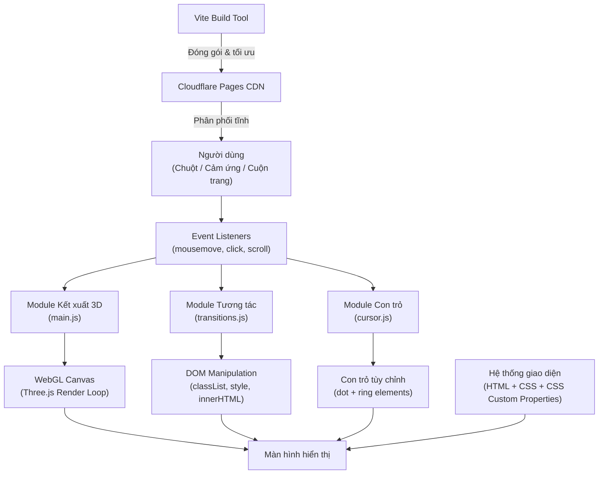

# Báo Cáo Dự Án: VRTX Studio Portfolio

## III. Kiến trúc và Thiết kế

### 1. Kiến trúc tổng quan

Ứng dụng VRTX Studio được xây dựng theo mô hình **Multi-Page Application (MPA)** tĩnh, kết hợp kết xuất đồ họa WebGL phía trình duyệt (client-side rendering). Toàn bộ tài nguyên được đóng gói bởi Vite và triển khai trên Cloudflare Pages CDN. Khi người dùng truy cập, trình duyệt tải các file HTML/CSS/JS tĩnh, sau đó các module JavaScript khởi tạo môi trường 3D, hệ thống tương tác và hiệu ứng giao diện.

**Sơ đồ tổng quan kiến trúc:**



**Các module chức năng chính:**

| Module | File | Đầu vào | Đầu ra | Chức năng |
|:---|:---|:---|:---|:---|
| Kết xuất 3D | `main.js` | Tọa độ chuột, thời gian (`performance.now`) | Canvas WebGL 60 FPS | Dựng logo 3D, ánh sáng, hậu kỳ (bloom, chromatic aberration) |
| Tương tác & UX | `transitions.js` | Sự kiện cuộn, click, tải trang | Thay đổi class CSS trên DOM | Chuyển trang, scroll reveal, theme toggle, marquee, bộ đếm số |
| Con trỏ tùy chỉnh | `cursor.js` | Tọa độ chuột, loại phần tử hover | Vị trí & trạng thái 2 phần tử DOM | Dot theo sát chuột, ring trễ bằng nội suy tuyến tính (lerp) |
| Giao diện | `style.css` + `*.html` | CSS Custom Properties, class toggle | Layout hiển thị | Responsive layout, Dark/Light mode, hiệu ứng hover |
| Hạt nền 2D | Inline script (about, services, works) | Kích thước viewport | Canvas 2D | Vẽ 300 hạt particle trôi nổi làm nền trang |

### 2. Yêu cầu thiết kế

Bài toán tổng quát "Xây dựng website portfolio studio sáng tạo" được phân rã thành 5 bài toán con:

- **Bài toán 1: Kết xuất logo 3D tương tác trên trình duyệt.**
  - *Phân tích:* Trang chủ cần một điểm nhấn thị giác thể hiện nhận diện thương hiệu dưới dạng 3D, phản hồi thao tác kéo chuột của người dùng.
  - *Giải pháp:* Sử dụng Three.js khởi tạo `Scene` + `PerspectiveCamera` + `WebGLRenderer`. Logo được tạo từ font Montserrat-Black.ttf bằng `TTFLoader` → `TextGeometry` → `MeshPhysicalMaterial` (iridescence + clearcoat). Điều khiển góc nhìn bằng `OrbitControls` với giới hạn góc quay.

- **Bài toán 2: Chuyển trang mượt mà trong kiến trúc đa trang.**
  - *Phân tích:* Chuyển đổi giữa các file HTML riêng biệt gây hiện tượng chớp trắng (flash of white).
  - *Giải pháp:* Chặn sự kiện click trên thẻ `<a>`, kích hoạt overlay CSS fade-out (`opacity: 0 → 1` trong 420ms), sau đó mới thực thi `window.location.href`.

- **Bài toán 3: Quản lý trạng thái giao diện Sáng/Tối xuyên suốt các trang.**
  - *Phân tích:* Trạng thái theme phải được duy trì khi chuyển trang hoặc tải lại.
  - *Giải pháp:* Lưu trạng thái vào `localStorage('vrtx-theme')`. Mỗi trang chèn một `<script>` đồng bộ ngay trong `<body>` để đọc và gán class `light-mode` trước khi DOM render, tránh hiện tượng nhấp nháy (FOUC). Toàn bộ phổ màu được điều khiển qua CSS Custom Properties (biến `--bg-color`, `--cyan`, v.v.).

- **Bài toán 4: Hiệu ứng cuộn trang và hoạt ảnh xuất hiện nội dung.**
  - *Phân tích:* Nội dung cần xuất hiện dần theo chiều cuộn để tạo cảm giác động và chuyên nghiệp.
  - *Giải pháp:* Sử dụng API `IntersectionObserver` với `threshold: 0.1` để phát hiện phần tử lọt vào viewport, sau đó gán class `.visible` kích hoạt CSS transition (`opacity` + `translateY`). Bộ đếm số thống kê sử dụng hàm easing `easeOutExpo` kết hợp `requestAnimationFrame`.

- **Bài toán 5: Con trỏ chuột tùy chỉnh phản hồi ngữ cảnh.**
  - *Phân tích:* Con trỏ mặc định của trình duyệt không thể hiện được ngôn ngữ thiết kế của studio.
  - *Giải pháp:* Ẩn con trỏ hệ thống bằng `cursor: none`. Tạo hai phần tử DOM: dot (theo sát chuột tức thì) và ring (trễ theo bằng nội suy tuyến tính `lerp(a, b, 0.11)`). Ring tự mở rộng và hiển thị nhãn khi hover lên các phần tử tương tác.

---

## IV. Triển khai

### 1. Cấu trúc dự án

Dự án sử dụng cấu trúc phẳng (flat structure) tại thư mục gốc, được quản lý bởi Vite:

```
vrtxstdio/
├── assets/images/           # Hình ảnh .webp, video .mp4, ảnh dự án
├── index.html               # Trang chủ (3D logo)
├── works.html               # Danh mục dự án
├── services.html            # Dịch vụ (5 mảng)
├── about.html               # Giới thiệu, team, giá trị
├── contact.html             # Biểu mẫu liên hệ
├── project-invicta.html     # Case study: Invicta
├── project-dailyform.html   # Case study: The Daily Form
├── project-fubon.html       # Case study: Fubon Guardians
├── project-flyfly.html      # Case study: FlyFly
├── project-bigtake.html     # Case study: Big Take
├── main.js                  # Module kết xuất 3D (Three.js)
├── transitions.js           # Module tương tác & UX
├── cursor.js                # Module con trỏ tùy chỉnh
├── style.css                # Hệ thống thiết kế CSS chung (1586 dòng)
├── vite.config.js           # Cấu hình Vite multi-page
└── package.json             # Dependencies: three ^0.184.0, vite ^8.0.9
```

**Ánh xạ file → module (Phần III):**

| Module (Phần III) | File triển khai |
|:---|:---|
| Kết xuất 3D | `main.js` (405 dòng) |
| Tương tác & UX | `transitions.js` (314 dòng) |
| Con trỏ tùy chỉnh | `cursor.js` (104 dòng) |
| Giao diện | `style.css` + 10 file `.html` |
| Hạt nền 2D | Inline `<script>` trong `about.html`, `services.html`, `works.html` |

### 2. Các khối chức năng chính

#### 2.1. Module Kết xuất 3D (`main.js`)

**Triển khai:**
- Khởi tạo `WebGLRenderer` với `alpha: true` (nền trong suốt, để CSS điều khiển màu nền), `antialias: true`, `toneMapping: ACESFilmicToneMapping`.
- Camera `PerspectiveCamera` FOV 42°, vị trí `z = 34`.
- Logo "VRTX" được tạo bằng `TTFLoader` tải font Montserrat-Black từ GitHub → `TextGeometry` (size 7.8, depth 3.8, bevelThickness 0.45) → `MeshPhysicalMaterial` cấu hình: `metalness: 0.75`, `roughness: 0.28`, `iridescence: 0.65`, `clearcoat: 0.6`.
- Hệ thống ánh sáng: 1 ambient, 1 directional (key light vàng ấm), 1 directional (fill light xanh mát), 2 SpotLight (rim magenta + cyan), 6 PointLight xoay quỹ đạo tạo hiệu ứng cầu vồng (iridescent accent).
- Hậu kỳ: `EffectComposer` → `RenderPass` → `UnrealBloomPass` (strength 0.25, threshold 0.65) → `RGBShiftShader` (amount 0.0018).
- Chuyển động: Logo dao động theo trục Y (sin), xoay ping-pong trên trục Y (±0.6 rad), 350 hạt particle 3D phát sáng additive.
- Chế độ Light Mode: `MutationObserver` theo dõi class trên `<body>`, ẩn mesh hiện wireframe khi bật light mode.

**Phát sinh kỹ thuật & giải quyết:**
- *Vấn đề:* `TextGeometry` tạo topology quá phức tạp (nhiều tam giác nhỏ trên bề mặt chữ R do thuật toán Earcut), gây giật khung hình khi hiển thị wireframe.
- *Giải quyết:* Viết thuật toán lọc đoạn thẳng: tính khoảng cách giữa cặp đỉnh (`v1.distanceTo(v2)`), phát hiện mặt phẳng (`Math.abs(v1.z - v2.z) < 0.05`), loại bỏ đoạn ngắn hơn 0.4 đơn vị trên mặt phẳng và 0.1 đơn vị trên bevel. Layer thêm `EdgesGeometry` (threshold 15°) cho đường viền sắc nét.

**Đánh giá:** Triển khai phù hợp với thiết kế lý thuyết tại Bài toán 1. Mọi thành phần (Scene, Camera, Material, Post-processing, OrbitControls) đều được cài đặt đúng như đề xuất.

#### 2.2. Module Tương tác & UX (`transitions.js`)

**Triển khai 10 chức năng trong các IIFE độc lập:**
1. **Page Transition:** Chặn click trên `<a>` cùng origin → gán class `active` cho overlay → `setTimeout(420ms)` → chuyển URL.
2. **Scroll Reveal:** `IntersectionObserver` (threshold 0.1) gán class `.visible` lên các phần tử `.reveal`.
3. **Glass Header:** Toggle class `.scrolled` khi `scrollY > 55`, thay đổi `background` và `border` của header.
4. **Stats Counter:** Đếm số từ 0 đến `data-target` bằng hàm `easeOutExpo`, thời lượng 1600ms.
5. **Marquee:** Nhân đôi `innerHTML` của `.marquee-track` để tạo vòng lặp liên tục.
6. **Mobile Nav:** Toggle hamburger menu với `classList.toggle('open')`, khóa scroll body.
7. **Theme Toggle:** Đọc/ghi `localStorage('vrtx-theme')`, toggle class `light-mode`, thêm class `theme-transitioning` trong 400ms để CSS transition mượt.
8. **Back To Top:** Cuộn mượt về đầu trang bằng `window.scrollTo({ behavior: 'smooth' })`.
9. **Force Scroll Top:** Đặt `history.scrollRestoration = 'manual'`, ép `scrollTo(0,0)` trên cả `pageshow` và `DOMContentLoaded`.
10. **Floating Thumbnail:** Tạo phần tử `#work-thumb-preview` hiển thị slideshow ảnh khi hover work card, cập nhật vị trí theo chuột.

**Phát sinh kỹ thuật & giải quyết:**
- *Vấn đề:* Trình duyệt khôi phục scroll position cũ khi bấm nút Back, gây lệch hiệu ứng reveal.
- *Giải quyết:* Kết hợp `history.scrollRestoration = 'manual'` với listener trên cả hai sự kiện `pageshow` và `DOMContentLoaded`.

**Đánh giá:** Triển khai phù hợp với Bài toán 2, 3, 4. Ngoài ra còn bổ sung thêm các chức năng không nằm trong thiết kế ban đầu (floating thumbnail, service number count-up, orbit hint auto-fade).

#### 2.3. Module Con trỏ tùy chỉnh (`cursor.js`)

**Triển khai:**
- Chỉ chạy trên thiết bị có `pointer: fine` (chuột), bỏ qua màn hình cảm ứng.
- Hai phần tử: `#cursor-dot` (7px, theo sát tức thì) và `#cursor-ring` (38px, trễ theo bằng `lerp(a, b, 0.11)`).
- Phát hiện ngữ cảnh: hàm `resolveLabel()` kiểm tra phần tử hover — `.work-card` → hiện chữ "View", `<a>/<button>` → hiện `aria-label` hoặc "↗".
- Ring mở rộng lên 68px khi hover phần tử tương tác (class `.is-link`).
- Hiệu ứng nhấn chuột: dot phóng to lên 12px khi `mousedown`, thu về 7px khi `mouseup`.

**Đánh giá:** Triển khai phù hợp với Bài toán 5. CSS sử dụng `mix-blend-mode: difference` để con trỏ luôn nhìn rõ trên mọi nền.

#### 2.4. Module Hạt nền 2D (Canvas Particles)

**Triển khai:**
- Inline script trong `about.html`, `services.html` (không phải file riêng).
- Tạo 300 hạt với bảng màu 5 sắc (cyan, magenta, gold, teal) trên `<canvas id="bg-canvas">`.
- Mỗi hạt có vận tốc ngẫu nhiên `dx/dy ∈ [-0.09, 0.09]`, bán kính `r ∈ [0.2, 1.5]`, alpha `∈ [0.06, 0.44]`.
- Vòng lặp `requestAnimationFrame` vẽ lại toàn bộ mỗi frame; hạt vượt biên viewport sẽ xuất hiện lại ở phía đối diện (wrap-around).

**Đánh giá:** Bổ sung ngoài thiết kế ban đầu, tạo chiều sâu thị giác cho các trang nội dung tĩnh.

#### 2.5. Module Giao diện (`style.css` + HTML)

**Triển khai:**
- Hệ thống thiết kế thống nhất qua CSS Custom Properties: `--green`, `--cyan`, `--magenta`, `--gold`, `--bg-color`, `--bg-transparent`.
- Light mode: class `body.light-mode` ghi đè `--bg-color: #f4eee6` và hơn 80 selector thay đổi màu chữ, viền, nền.
- Responsive: Breakpoint chính tại `860px` (ẩn nav desktop, hiện hamburger) và `768px` (chuyển grid 2 cột → 1 cột).
- Hiệu ứng hover toàn cục: Selector `[class*="card"], [class*="stat-"], [class*="team-"]` tự động áp dụng `translateY(-4px)` + `box-shadow` khi hover.
- Hệ thống animation: `@keyframes nav-gradient-flow` (gradient chuyển động 10s), `parallelogram-reveal` (label xuất hiện), `pulse-dot` (nút nhấp nháy).

**Đánh giá:** Phù hợp với Bài toán 3. Hệ thống CSS Custom Properties cho phép chuyển đổi theme mà không cần JavaScript can thiệp vào từng phần tử.

---

## V. Kết quả và Đánh giá

### 1. Kết quả

| Mục tiêu ban đầu | Kết quả đạt được | Trạng thái |
|:---|:---|:---|
| Website portfolio đa trang | 5 trang chính + 5 case study + loading screen | ✅ Đạt |
| Đồ họa 3D tương tác | Logo VRTX 3D, vật liệu iridescent, orbit, bloom | ✅ Đạt |
| Chế độ Sáng/Tối | Dark mặc định, Light mode 80+ CSS override, lưu localStorage | ✅ Đạt |
| Responsive | Breakpoint 860px/768px, hamburger menu, grid tự chuyển cột | ✅ Đạt |
| Chuyển trang mượt | Overlay fade 420ms, force scroll top | ✅ Đạt |
| Triển khai trực tuyến | Live tại vrtxstdio.pages.dev (Cloudflare CDN) | ✅ Đạt |

### 2. Đánh giá

**Hiệu năng:**
- Máy tính GPU rời: 60 FPS ổn định tại trang chủ (Three.js).
- Thiết bị di động cũ: `UnrealBloomPass` đôi lúc gây trễ (~45 FPS). Các trang không dùng Three.js chạy mượt trên mọi thiết bị.
- Lỗi nhỏ đã biết: trên Safari iOS, `backdrop-filter: blur()` trên header đôi lúc render chậm hơn Chrome.

**Ưu điểm:**
- Tích hợp WebGL 3D vào web truyền thống liền mạch.
- Vanilla JS (không framework) — website nhẹ, dễ kiểm soát.
- CSS Custom Properties cho phép thay đổi theme toàn cục chỉ bằng 1 class toggle.
- MPA hỗ trợ SEO tốt (mỗi trang có `<title>` và `<meta>` riêng).

**Nhược điểm & Định hướng:**
- Three.js bundle lớn (~500KB gzipped) làm tăng thời gian tải lần đầu. → *Lazy-load module 3D.*
- Code particle background lặp lại ở 3 file HTML. → *Tách thành file `particles.js` riêng.*
- Chưa có CMS quản lý nội dung. → *Tích hợp headless CMS nếu cần cập nhật thường xuyên.*

---

## VI. Quá trình làm việc nhóm

### 1. Phân công công việc

Bảng 1. Phân công công việc.

| Họ tên | MSV | Phân công | Tỉ lệ đóng góp (%) |
| :--- | :--- | :--- | :--- |
| Trần Gia Bảo | [Mã SV] | Quản lý dự án & Cấu trúc nội dung | 20% |
| Hoàng Đức Duy | [Mã SV] | Lập trình đồ họa 3D (Three.js) & WebGL | 20% |
| Nguyễn Phạm Sơn Hà | [Mã SV] | Thiết kế UI/UX & Responsive CSS | 20% |
| Hồ Trung Hiếu | [Mã SV] | Tích hợp Media (Âm thanh, Video) & Testing | 20% |
| Trần Khánh Long | [Mã SV] | Hiệu ứng Tương tác (Transitions, Animations) | 20% |

### 2. Tuyên bố về việc sử dụng AI

Nhóm đã sử dụng công cụ AI hỗ trợ các phần việc sau:
- **Tối ưu thuật toán wireframe:** Đề xuất cách lọc đỉnh trên `TextGeometry` để tăng FPS.
- **Cấu hình ánh sáng 3D:** Tinh chỉnh `MeshPhysicalMaterial` (iridescence, clearcoat) và SpotLight/PointLight.
- **Logic chuyển trang:** Viết logic chặn sự kiện điều hướng + overlay fade cho page transition.
- **CSS responsive & light mode:** Viết selector override cho Light Mode và cấu trúc Grid/Flexbox responsive.

---

## TÀI LIỆU THAM KHẢO

1. **Three.js Documentation.** TextGeometry, MeshPhysicalMaterial, EffectComposer, UnrealBloomPass. *https://threejs.org/docs/*
2. **MDN Web Docs.** IntersectionObserver, localStorage, MutationObserver, History API. *https://developer.mozilla.org/*
3. **Vite Documentation.** Cấu hình multi-page application. *https://vitejs.dev/guide/*
4. **Google Fonts — Montserrat.** Font nguồn cho TextGeometry 3D. *https://fonts.google.com/specimen/Montserrat*
5. **Cloudflare Pages Docs.** Triển khai static site. *https://developers.cloudflare.com/pages/*
6. **Google Fonts — Inter & Playfair Display.** Font giao diện web. *https://fonts.google.com/*
